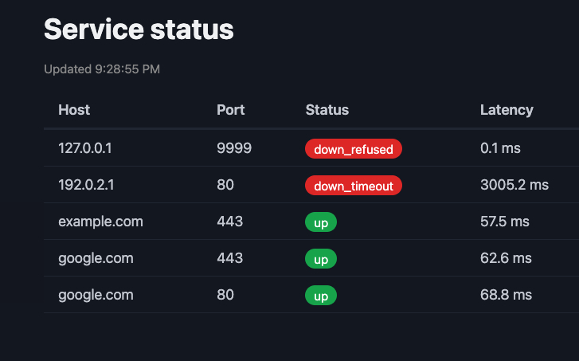

# nixel

[](https://github.com/hshei/nixel/actions/workflows/ci.yml)

A lightweight service-monitoring system written in C. A tiny agent runs health
checks against your services and streams results over a custom binary protocol
to an ingest server, which parses, validates, and stores them. A zero-dependency
web dashboard shows live status.

Built from raw sockets — no monitoring framework, no HTTP client library, no ORM.



## Why

Most monitoring agents (Datadog, node_exporter, Vector) are built on Go, Python,
or Node and ship as multi-megabyte binaries. nixel's agent is a **34 KB** static
C binary with zero runtime dependencies — small enough to drop onto constrained
hosts and edge gateways where a heavyweight collector doesn't fit.

| | nixel agent | node_exporter |
| --- | --- | --- |
| Binary size | **34 KB** | 13 MB |
| RSS | ~8.5 MB* | ~15.8 MB** |
| Idle CPU | ~0% | ~0% |
| Runtime deps | none | none |
| Language | C | Go |

Measured on the same machine (Apple Silicon, macOS). node_exporter v1.11.1,
binary size stripped for nixel. node_exporter collects 100+ system metrics
via a pull-based HTTP endpoint; nixel runs outbound TCP health checks — this
compares agent footprint, not feature parity.

*nixel RSS is peak resident size from a single one-shot run (`/usr/bin/time -l`).
**node_exporter RSS is steady-state resident size while idle (`ps`).

## Architecture

```
target service                        your host
  ┌────────────┐   TCP health check     ┌──────────────────┐
  │ example.com│◀────────────────────── │  agent (C)       │
  │   :443     │                        │  - non-blocking  │
  └────────────┘                        │    connect+select│
                                        │  - classifies    │
                                        │    up/refused/   │
                                        │    timeout/error │
                                        └────────┬─────────┘
                                                 │ length-prefixed
                                                 │ JSON frame
                                                 ▼
                                        ┌──────────────────┐
                                        │  server (C)      │
                                        │  - unframe       │
                                        │  - bound-check   │
                                        │  - parse (cJSON) │
                                        │  - store (SQLite)│
                                        └────────┬─────────┘
                                                 │
                                                 ▼
                                        ┌──────────────────┐
                                        │ dashboard (Node) │
                                        │ reads SQLite,    │
                                        │ serves status    │
                                        └──────────────────┘
```

## How it works

**Health check.** The agent does a non-blocking `connect()` with a `select()`
timeout, then inspects `SO_ERROR` to classify the result as `up`,
`down_refused` (host reachable, port closed — instant TCP RST),
`down_timeout` (no response within the deadline), or `error`. Latency is
measured on `CLOCK_MONOTONIC`.

**Wire protocol.** Each result is a length-prefixed frame: a 4-byte big-endian
length, followed by that many bytes of JSON. The server reads exactly N bytes,
so message boundaries are never ambiguous over the TCP stream. See
[PROTOCOL.md](PROTOCOL.md).

**Ingest.** The server bound-checks every length prefix before allocating,
parses JSON defensively (rejecting malformed input without crashing), and
inserts via prepared statements (no SQL injection). It reads a stream of frames
per connection, so one agent stays connected and keeps reporting.

## Configuration

The agent reads targets from a config file (default `nixel.conf`, or pass a path
as the first argument). One target per line, plus an optional check interval:

```
interval 10          # seconds between full passes over all targets
example.com 443
localhost   9000
1.1.1.1     53
```

Blank lines and `#` comments are ignored. Copy `nixel.conf.example` to
`nixel.conf` and edit. The target list grows dynamically — no fixed cap.

## Reliability

The agent holds one long-lived connection to the server and streams results over
it. If a send fails (server restarted, network blip), it closes the socket and
reconnects with exponential backoff (1s, doubling, capped at 30s), resetting once
it's back. `SIGPIPE` is ignored, so a write to a dead connection returns an error
the loop handles rather than killing the process. Both agent and server shut down
cleanly on SIGTERM/SIGINT and report zero leaks under `leaks`.

## Build

```
make all          # builds ./nixel (agent) and ./nixel-server
```

Requires a C compiler and SQLite (`-lsqlite3`).

## Run

```
# 1. start the ingest server (listens on :9000, writes nixel.db)
./nixel-server

# 2. start the agent daemon — checks every target on a loop
./nixel nixel.conf

# 3. start the dashboard (needs Node 22+)
cd dashboard && node server.js     # http://localhost:3000
```

The agent runs until stopped. Send SIGINT (Ctrl-C) or SIGTERM to shut it down
cleanly. If the server goes away, the agent keeps running and reconnects on its
own with exponential backoff — no need to restart it.

## Status

Working end-to-end as a daemon: config-driven multi-target agent → persistent
connection with reconnect/backoff → server → SQLite → dashboard.

Roadmap: per-tenant authentication, and a multi-client server (`poll`/`epoll`) —
today the server handles one persistent agent connection at a time.
